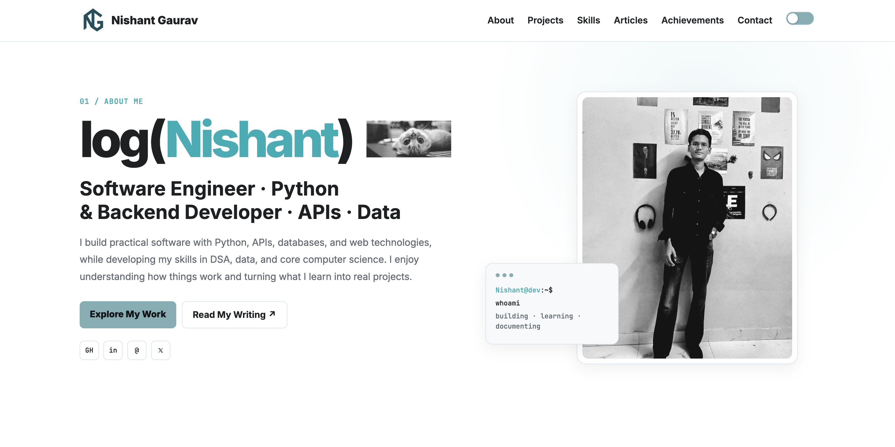
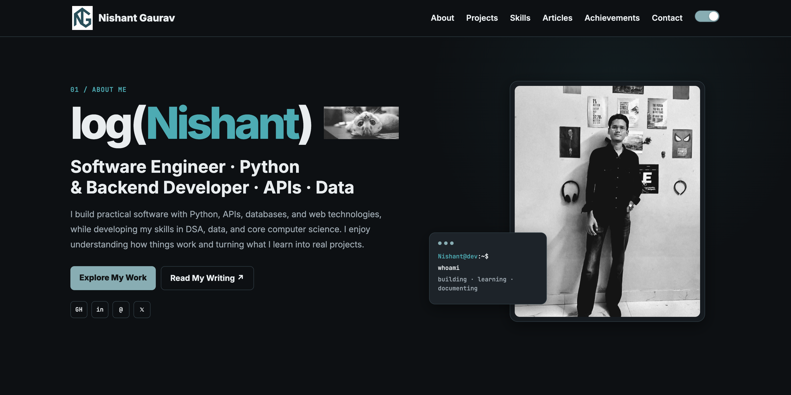

# Nishant Gaurav -- Portfolio Website

A personal developer portfolio built with **HTML5, CSS3, JavaScript, and
Bootstrap 5**. It presents my projects, technical skills, articles,
certifications, community work, and ways to get in touch.

The site uses a dark-first visual identity with a light-mode option,
responsive layouts, smooth section navigation, project cards, technical
skill groups, achievement cards, and a simple contact form.

**Live:** [nishant05gaurav.github.io](https://nishant05gaurav.github.io)


## Quick Start

``` bash
git clone https://github.com/nishant05gaurav/nishant05gaurav.github.io.git

cd nishant05gaurav.github.io

# No build step required
open index.html
```

You can also open `index.html` directly in your browser.

There is no Node.js setup, npm install, bundler, or build process
required.


## Preview

**Live site:**
[nishant05gaurav.github.io](https://nishant05gaurav.github.io)

### Light Mode



### Dark Mode




The portfolio uses a dark-first interface with a light-mode option. The
theme preference is stored using `localStorage`, so the selected mode
can be restored when the site is opened again.


## Problem & Purpose

I wanted a portfolio that works as more than a collection of links.

It is designed as a living representation of the things I build, learn,
and document --- from software projects and core computer science
concepts to technical writing, data, backend development, APIs,
automation, and AI-related work.

The site deliberately avoids a large frontend framework because the
portfolio itself is also a frontend project. The goal is to keep the
code understandable, lightweight, responsive, and easy to deploy through
GitHub Pages.


## Highlights

-   **Dark-first design with light mode** --- the portfolio starts in
    dark mode and supports switching between dark and light themes. The
    selected theme is stored in `localStorage`.

-   **Responsive layout** --- Bootstrap 5 is used alongside custom CSS
    to keep the navbar, project cards, achievement cards, contact
    section, and other layouts usable across screen sizes.

-   **Project-focused portfolio** --- the projects section currently
    presents GhostSpot, NOVA AI Assistant, recLog, Habit Flow Engine,
    Algorithm Analyzer, and the Portfolio Website.

-   **Technical skills section** --- skills are grouped into Languages,
    Backend & APIs, Data & AI, Systems & Tools, and Core CS.

-   **Technical writing** --- the Articles section presents writing
    around development, DSA, Dynamic Programming, and the logic behind
    the concepts being learned.

-   **Achievements & certifications** --- certificate images are stored
    locally in `assets/img/certificates/` and displayed directly in the
    portfolio.

-   **Simple contact flow** --- the contact form uses JavaScript to open
    the visitor's default email client with the submitted details.

-   **No build tooling** --- the site can be opened directly from
    `index.html` and deployed as a static GitHub Pages site.

-   **Semantic HTML structure** --- the page is organized using elements
    such as `<header>`, `<main>`, `<section>`, `<article>`, and
    `<footer>`.


## Features

-   Sticky navigation bar
-   About / Who I Am section
-   Dark / light mode toggle
-   Theme persistence using `localStorage`
-   Technical Skills section
-   DEV and Medium navigation links
-   `log(Nishant)` writing/project identity


## Projects

### GhostSpot

A geospatial risk-analysis project that uses spatial and business data
to study commercial locations and predict closure-risk probabilities
through a machine-learning workflow.

**Stack:** Python, Flask, PostgreSQL, PostGIS, scikit-learn, Pandas,
Leaflet.js, REST APIs

[GitHub](https://github.com/nishant05gaurav)

### NOVA AI Assistant

A Python-based assistant exploring speech recognition, AI responses,
external APIs, and text-to-speech workflows.

**Stack:** Python, Gemini API, SpeechRecognition, PyAudio, pyttsx3, APIs

[GitHub](https://github.com/nishant05gaurav)

### recLog

An automation project that connects a Dev.to publishing workflow with a
personal portfolio using Python and GitHub Actions.

**Stack:** Python, Dev.to API, GitHub, GitHub Actions, automation, APIs

[GitHub](https://github.com/nishant05gaurav/recLog)

### Habit Flow Engine

A personal software project focused on turning habit-building ideas into
a structured and trackable workflow.

**Stack:** Python, NumPy, data processing, simulation, workflow logic

[GitHub](https://github.com/nishant05gaurav)

### Algorithm Analyzer

A Python project focused on analysing algorithmic behaviour and making
problem-solving concepts easier to inspect and understand.

**Stack:** Python, algorithms, data structures, complexity analysis,
problem solving

[GitHub](https://github.com/nishant05gaurav)

### Portfolio Website

The portfolio itself --- built to present projects, technical skills,
writing, certifications, and the work behind them.

**Stack:** HTML5, CSS3, JavaScript, Bootstrap 5, Git, GitHub

[GitHub](https://github.com/nishant05gaurav)


## Technical Skills

  -----------------------------------------------------------------------
  Category                            Skills
  ----------------------------------- -----------------------------------
  Languages                           C, C++, Python, SQL, JavaScript,
                                      HTML, CSS

  Backend & APIs                      Flask, REST APIs, PostgreSQL,
                                      PostGIS, MySQL, MongoDB, JSON, API
                                      Integration

  Data & AI                           NumPy, Pandas, Matplotlib, Seaborn,
                                      scikit-learn, Data Analysis,
                                      Machine Learning, Gemini API

  Systems & Tools                     Linux, Git, GitHub, GitHub Actions,
                                      Docker, AWS, Azure, Bootstrap

  Core CS                             Data Structures & Algorithms, OOP,
                                      DBMS, Operating Systems, Computer
                                      Networks, Problem Solving
  -----------------------------------------------------------------------


## Articles & Writing

The portfolio includes a small selection of technical writing around
software development and DSA.

Current article entries include:

-   **How I Built My Portfolio Website From Scratch**
-   **Matrix Chain Multiplication: A New DP Pattern**
-   **Palindrome Partitioning: The MCM Skeleton**
-   **Boolean Parenthesization: Counting Instead of Minimising**

The article links in the current JavaScript are intentionally left as
`#` placeholders until the final DEV/Medium URLs are added.

The portfolio also links to **log(Nishant)** for notes and technical
writing:

[log(Nishant)](https://nishant05gaurav.github.io/)


## Achievements & Certifications

The current portfolio includes:

-   Microsoft Learn Student Ambassador
-   Cloud Skills Challenge Event Host
-   AZ-900 Azure Fundamentals
-   AWS Graduate --- Data Engineering
-   AWS Machine Learning Foundations

Certificate images are stored here:

``` text
assets/img/certificates/
├── ambassador.jpg
├── cloud-event.jpg
├── az900.jpg
├── aws-data.jpg
└── aws-ml.jpg
```


## Tech Stack

  Layer           Tools
  --------------- -------------------------------------------
  Markup          HTML5
  Styling         CSS3
  UI Framework    Bootstrap 5.3.3
  Interactivity   Vanilla JavaScript
  Fonts           Inter, JetBrains Mono
  Theme           CSS variables + JavaScript + localStorage
  Deployment      GitHub Pages

External resources used by the page include Bootstrap 5.3.3 and Google
Fonts.


## Project Structure

``` text
nishant05gaurav.github.io/
│
├── assets/
│   └── img/
│       ├── profile_photo.jpeg
│       ├── logo_primary.png
│       ├── logo_secondary.png
│       ├── cat.gif
│       ├── favicon.png
│       └── certificates/
│           ├── ambassador.jpg
│           ├── cloud-event.jpg
│           ├── az900.jpg
│           ├── aws-data.jpg
│           └── aws-ml.jpg
│
├── css/
│   └── style.css
│
├── JS/
│   └── main.js
│
├── index.html
└── README.md
```


## Deployment

The portfolio is designed to be hosted directly on **GitHub Pages**.

Repository:

[github.com/nishant05gaurav/nishant05gaurav.github.io](https://github.com/nishant05gaurav/nishant05gaurav.github.io)

For your own GitHub Pages fork:

1.  Fork the repository.
2.  Open **Settings → Pages**.
3.  Select the branch containing the website.
4.  Select `/ (root)` as the folder.
5.  Save the configuration.
6.  GitHub Pages will provide the corresponding site URL.


## Customization

Most portfolio content can be changed directly in `index.html`.

### About

Update the biography, current focus, statistics, GitHub link, LinkedIn
link, and resume link.

### Projects

Update each project card's:

-   Project name
-   Description
-   Technology tags
-   GitHub URL

### Technical Skills

Add or remove skill chips inside the relevant skill group.

### Articles

Update the article titles, descriptions, and the `writingLinks` object
in `JS/main.js` with the final DEV and Medium URLs.

### Achievements

Replace certificate images inside:

``` text
assets/img/certificates/
```

and update the corresponding titles and organizations in `index.html`.

### Contact

Update the LinkedIn, GitHub, email, and `log(Nishant)` links in the
contact section and footer.

### Theme

Theme colors and layout styles are maintained in:

``` text
css/style.css
```

The JavaScript theme logic and contact-form behavior are maintained in:

``` text
JS/main.js
```


## License

MIT License --- use it, fork it, build on it.


## Author

Built by **Nishant Gaurav**

-   [GitHub](https://github.com/nishant05gaurav)
-   [LinkedIn](https://shorturl.at/kWLs5)
-   [X](https://x.com/_im_nishant14)
-   [Email](mailto:nishant05gaurav@gmail.com)
-   [log(Nishant)](https://nishant05gaurav.github.io/)